# Connecting to the hub on Linux
### If you are using WSL, see the [official guide](https://www.ev3dev.org/docs/tutorials/connecting-to-the-internet-via-bluetooth/) for windows.

---

### 1: On the EV3 brick, navigate to "Wireless and Networks"

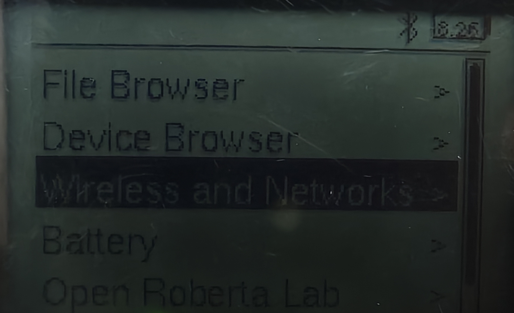

### 2: In the "Wireless and Networks" menu, navigate to "Tethering"

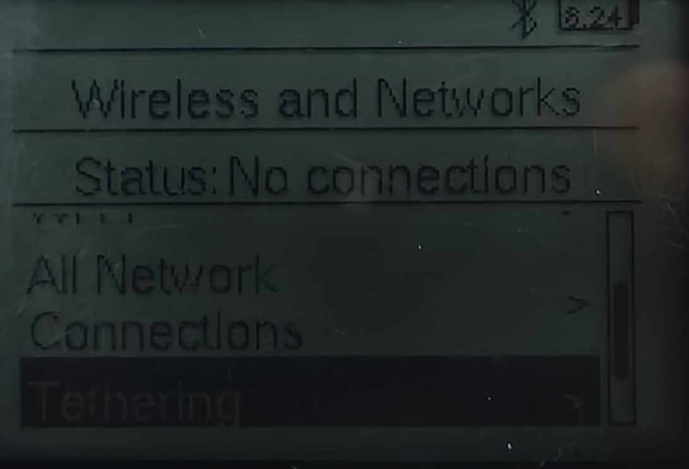

### 3: In the "Tethering" page, ensure that "Bluetooth" is enabled (box filled)
At this point, you should see an ip address in the top left corner. 
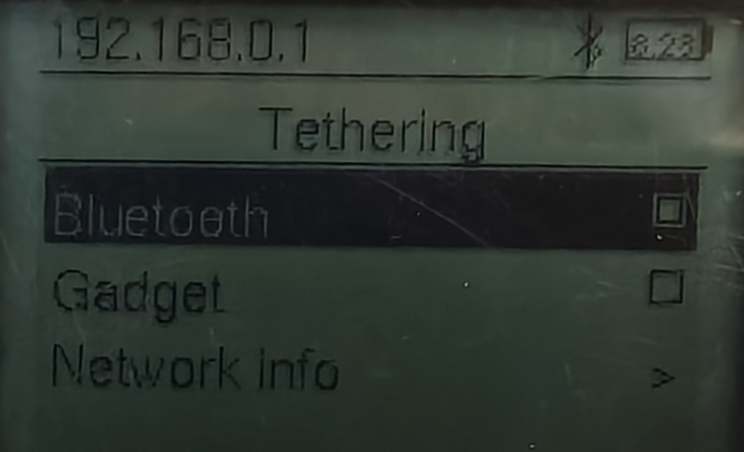

### 4: Go back to the "Wireless and Networks" menu and navigate to "Bluetooth"
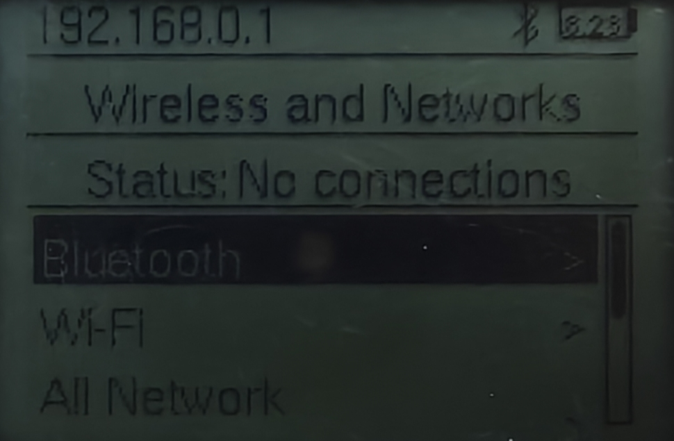

### 5: In the "Bluetooth" page, ensure that "Powered" and "Visible" are both enabled (boxes filled)
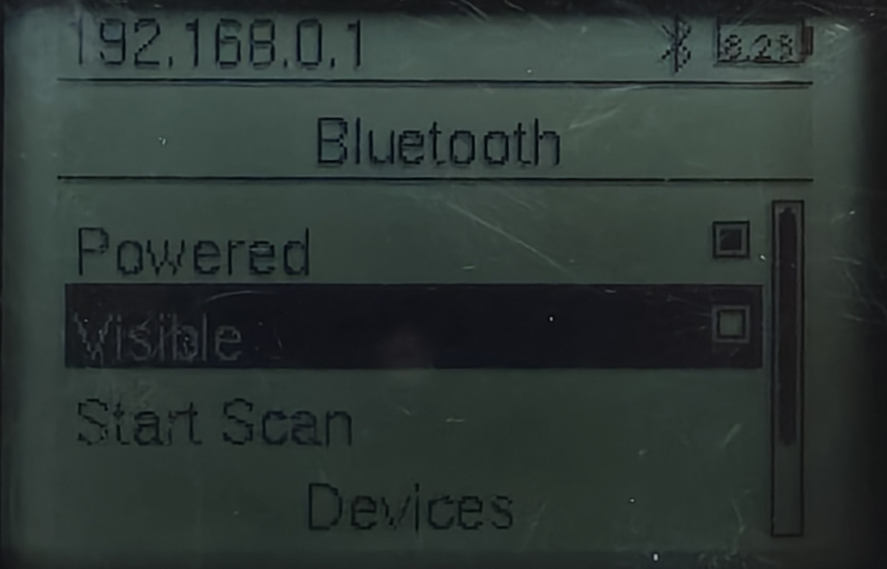

### 6: On your computer, navigate to "pair device" in the Bluetooth menu
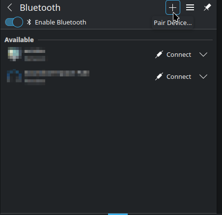

### 7: In the "Select Device" menu, double click "ev3dev" when it appears
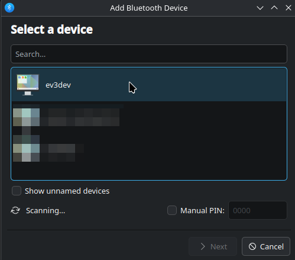

### 8: You should see a prompt on the brick and computer to confirm a passkey.
If they match, press "Matches" on the computer and "Accept" on the robot

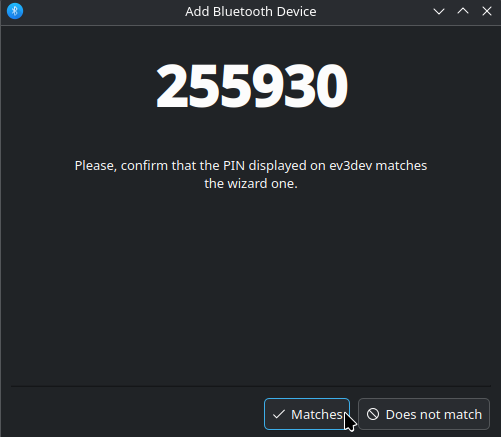
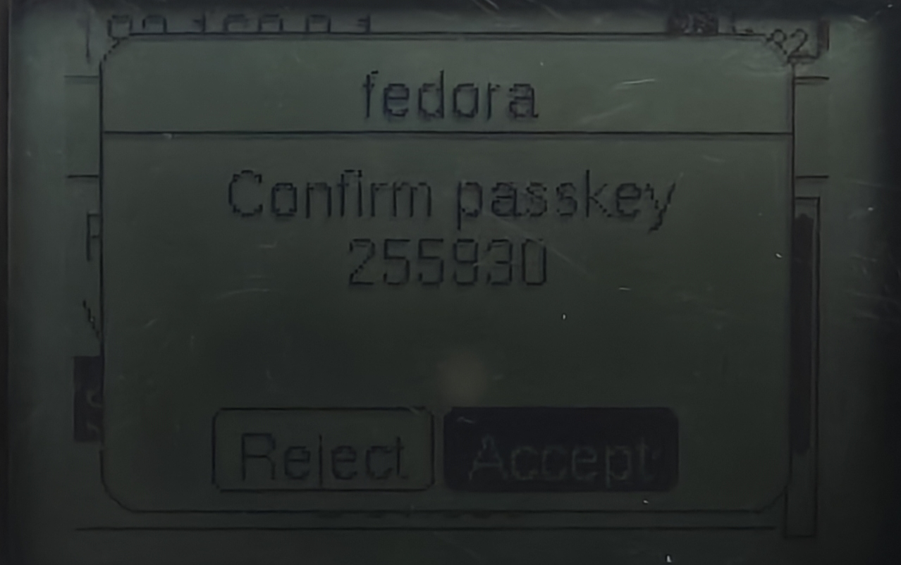

### 9: On the computer, you should see a "connecting" and a "setup failed" screen
Don't worry about the "setup failed" screen, this is completely normal. 
You can close it out as we will not be needing it anymore.

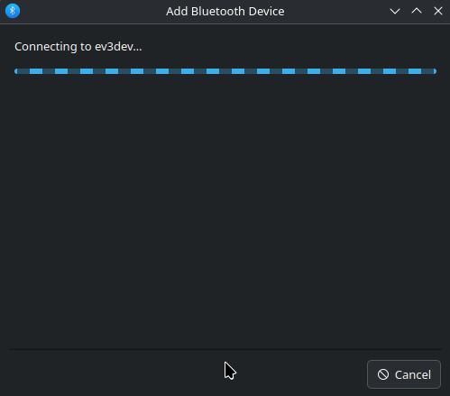
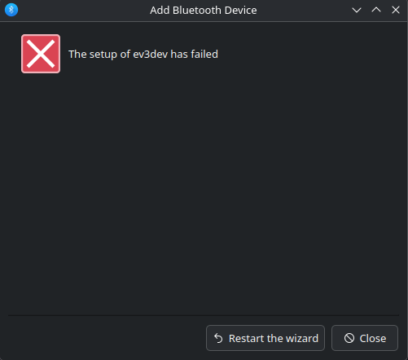

### 10: In your wifi menu, you should see "ev3dev Network" under "Available"
Press "Connect"

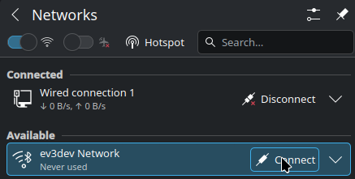

### 11: When you press "Connect", you should see this menu on the EV3 brick:
Press accept

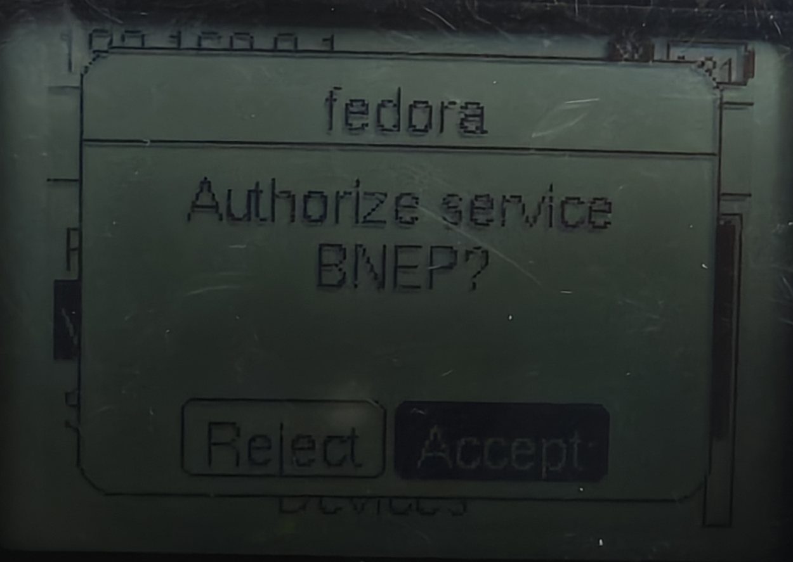

### 12: You are now connected! To test your connection, you can ssh into the robot with the ip address in the top left corner
The password is "maker"

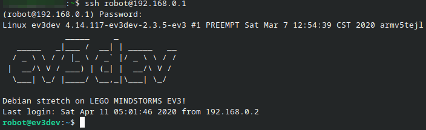

### Use steps 10-12 when re-connecting in the future.
